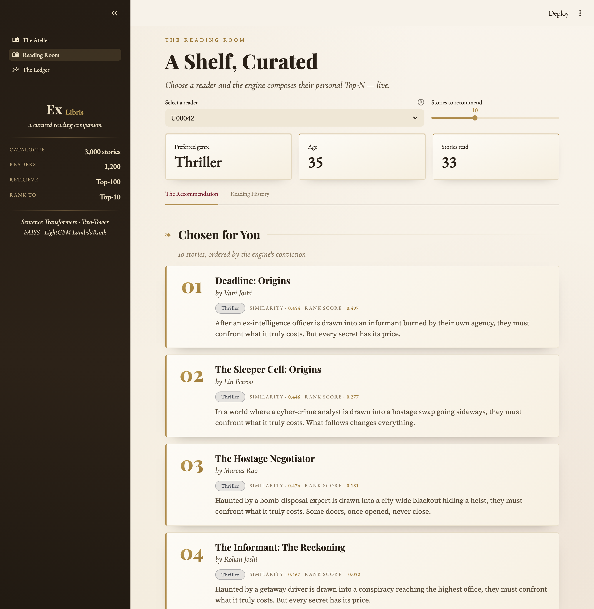
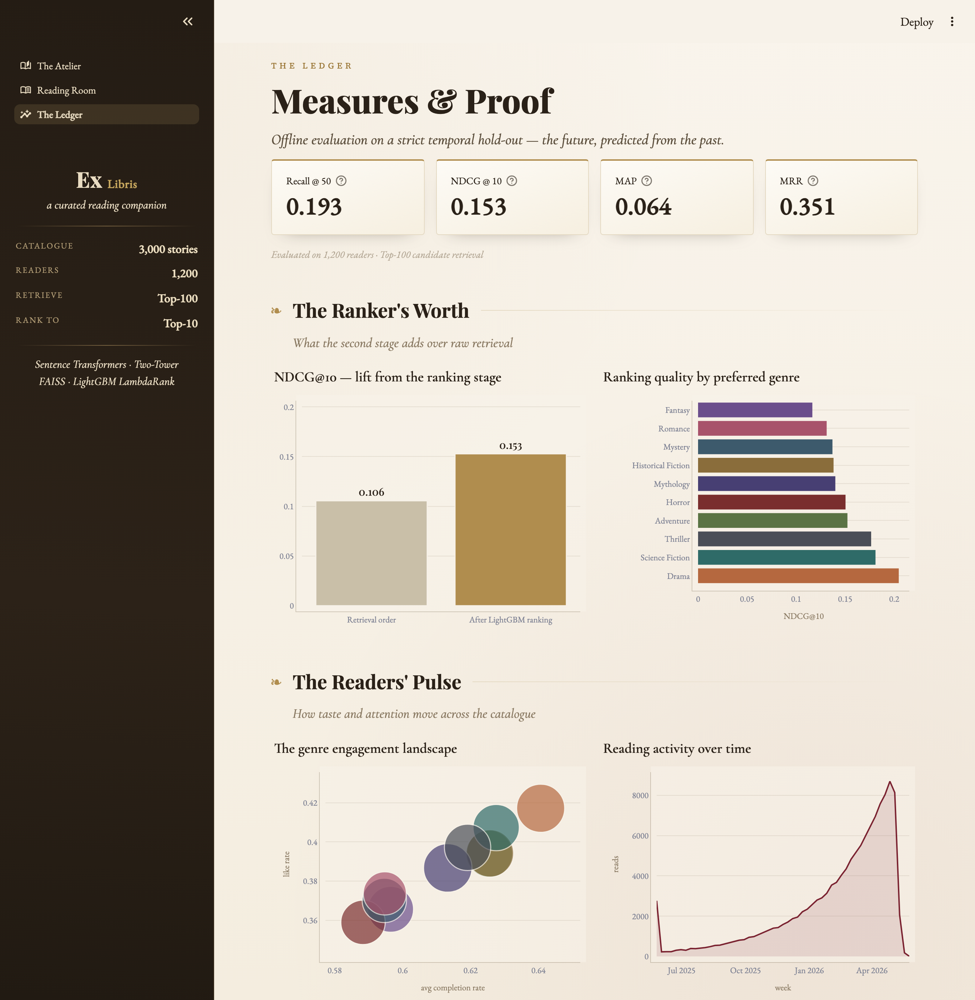

# 📖 Ex Libris — Personalized Story Recommendation & Ranking Engine

> *Ex Libris* — “from the library of —”, the inscription on a personalized
> bookplate. A library curated for every reader.

A production-style, end-to-end **two-stage recommendation system** for a
story-reading platform (think Pratilipi / Medium / Wattpad). Stories are
understood with **Transformer embeddings**, users are modeled from their
reading history, candidates are retrieved with a **Two-Tower network + FAISS**,
and final recommendations are ordered by a **LightGBM Learning-to-Rank** model
— all evaluated with standard ranking metrics and served through an
interactive **Streamlit dashboard**.

<p align="center">
  
</p>

```
                ┌─────────────────────────  STAGE 1: RETRIEVAL  ─────────────────────────┐
 story text ──► Sentence Transformer ──► Item Tower ──► FAISS index ─┐
                (all-MiniLM-L6-v2)                                   ├──► Top-100 candidates
 reading    ──► engagement-weighted  ──► User Tower ──► query vector ┘          │
 history        profile (recency ½-life)                                        ▼
                └───────────────────────────────────────────┐   ┌──  STAGE 2: RANKING  ──┐
                                                            │   │ 12 user/story/cross    │
                                                            │   │ features → LightGBM    │
                                                            │   │ LambdaRank → Top-10    │
                                                            └───┴────────────────────────┘
```

## Highlights

- **Semantic story embeddings** — `all-MiniLM-L6-v2` encodes
  *title + genre + description* into 384-d vectors.
- **User modeling** — profiles are the engagement-weighted average of read
  stories (completion x likes x 60-day recency half-life).
- **Two-Tower retrieval (PyTorch)** — trained with in-batch sampled softmax
  (temperature 0.07), duplicate-positive masking, cosine-normalised towers.
- **FAISS candidate generation** — exact inner-product search over the item
  tower space; Top-100 candidates per user with already-read filtering.
- **Learning-to-Rank** — LightGBM `lambdarank` trained leak-free on a
  chronological re-split of the train window; optimises NDCG directly.
- **Honest offline evaluation** — strict *temporal* hold-out (last 20% of each
  user's reads): Recall@50, NDCG@10, MAP, MRR, plus a retrieval-only baseline
  so the ranking stage's lift is visible.
- **MLflow tracking** (SQLite backend), **Dockerized** deployment, and a
  themed **Streamlit dashboard** with live recommendations and analytics.

## The Dashboard

An editorial "fine library" interface — ivory paper, antique gold, classic
serif typography — across three pages.

**Reading Room** — live, two-stage recommendations as gilded book-plate cards
(FAISS retrieval → LightGBM ranking), with each reader's history and the
retrieval affinity behind every chosen title.

<p align="center">
  
</p>

**The Ledger** — offline evaluation and analytics: ranking-stage lift, quality
by genre, the engagement landscape, reading activity over time, ranker feature
importance, and the two-tower training curve.

<p align="center">
  
</p>

## Quickstart

The repo ships with the trained artifacts, so the dashboard runs immediately:

```bash
pip install -r requirements.txt      # light runtime deps (no torch needed)
streamlit run dashboard/app.py
```

To **retrain everything from scratch** (regenerates the dataset, embeddings,
Two-Tower model, FAISS index, ranker and metrics):

```bash
pip install -r requirements-train.txt   # adds torch, sentence-transformers, …
python pipeline.py
```

Resume from any step, e.g. retrain only the ranker and re-evaluate:

```bash
python pipeline.py --from 7
```

Inspect experiment runs:

```bash
mlflow ui --backend-store-uri sqlite:///mlflow.db
```

### Docker

```bash
docker build -t storyrec .
docker run -p 8501:8501 storyrec     # dashboard at http://localhost:8501
```

## Deploy a public link (free)

The app is ready for **[Streamlit Community Cloud](https://share.streamlit.io)** —
it serves from the committed artifacts, so no training runs in the cloud:

1. Sign in to <https://share.streamlit.io> with the GitHub account that owns this repo.
2. **Create app → from existing repo**, then set:
   - **Repository:** this repo · **Branch:** `main`
   - **Main file path:** `dashboard/app.py`
   - **Advanced → Python version:** `3.11`
3. **Deploy.** First build takes a minute; afterwards every `git push` redeploys.

You get a public `https://<your-app>.streamlit.app` link anyone can open.
`requirements.txt` is kept torch-free and `packages.txt` installs `libgomp1`,
so the app stays within the free tier's memory.

## Dataset

A synthetic but *behaviourally realistic* story platform
(`src/preprocessing/generate_data.py`):

| Table | Rows | Columns |
|---|---|---|
| `users.csv` | 1,200 | user_id, age, preferred_genre |
| `stories.csv` | 3,000 | story_id, title, description, genre, author, avg_reading_minutes, … |
| `interactions.csv` | ~160K | user_id, story_id, clicks, reading_time, likes, completion_rate, timestamp |

Realism is built in: users get sparse Dirichlet genre affinities (1–3 dominant
genres), activity follows a power law (few heavy readers, many casual),
stories carry a latent quality score, exposure popularity is long-tailed, and
engagement (completion, likes, reading time) correlates with taste match —
so the models learn genuine signal, not noise.

## Project structure

```
├── data/                 # raw CSVs + processed parquet/embeddings
├── src/
│   ├── config.py         # all hyper-parameters in one place
│   ├── preprocessing/    # dataset generation + temporal split
│   ├── embeddings/       # story (SBERT) & user (weighted-history) vectors
│   ├── retrieval/        # two-tower model + FAISS store
│   ├── ranking/          # feature engineering + LightGBM LambdaRank
│   ├── evaluation/       # ranking metrics + offline evaluation
│   ├── utils/
│   └── recommender.py    # serving facade (retrieve → rank → Top-N)
├── dashboard/app.py      # Streamlit app (Home / Recommendations / Analytics)
├── models/  faiss_index/  reports/
├── pipeline.py           # one-command orchestrator
├── Dockerfile
└── requirements.txt
```

## Evaluation protocol

For every user, the **most recent 20%** of interactions are held out — the
model must predict the *future* from the past, with already-read stories
excluded from every recommendation list (matching serving behaviour).

| Metric | Measures | Stage |
|---|---|---|
| **Recall@50** | did the Top-50 FAISS candidates contain the held-out reads? | Retrieval |
| **NDCG@10** | are relevant stories at the top of the final list? | Ranking |
| **MAP** | precision across all relevant positions | Ranking |
| **MRR** | how early does the first relevant story appear? | Ranking |

Run `python pipeline.py` and the scores land in `reports/metrics.json` and on
the dashboard's **Analytics** page, including the NDCG lift of the ranking
stage over raw retrieval order.

## Tech stack

Python · Pandas · NumPy · PyTorch · HuggingFace Sentence-Transformers ·
FAISS · LightGBM · scikit-learn · Plotly · Streamlit · MLflow · Docker
